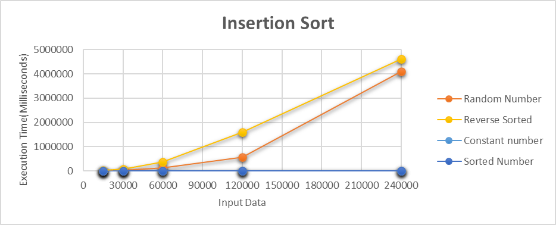
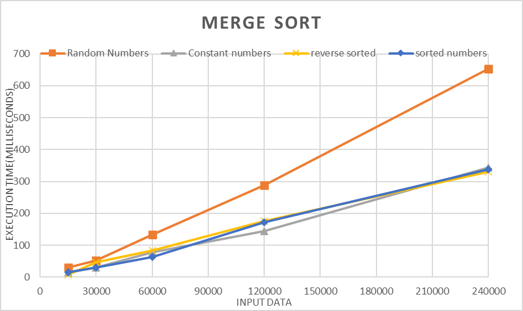
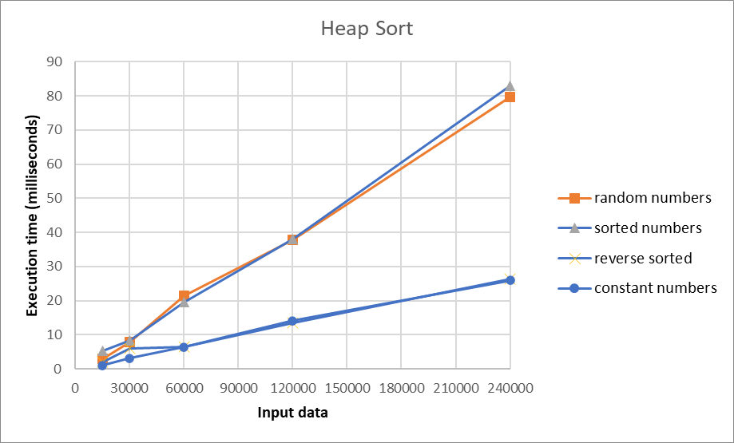
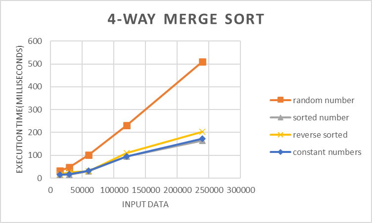
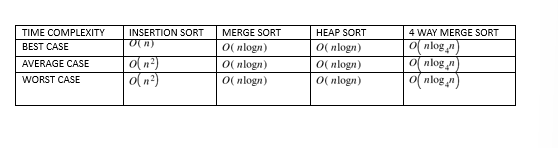

# DataStructure_Sorting

In this project, I have completed four sorting algorithms
1. Insertion sort
2. Merge sort 
3. Heap sort
4. 4-way merge sort

## Description: 
This project is sorting 20 input files using insertion sort, merge sort, heap sort, 4 way merge sort and calculating size, comparisions, execution time.

## Requirements for this project.

I have done the insertion sorting program in python language.
1.Install Python --- https://www.python.org/downloads/
2.20 input files which I have generated from genDataset.py file
                     

Steps to run my project are:

I have submitted the project on canvas so you have to download it from there.
1. Download the file and save it wherever you want and then unzip it.
2. Open your command prompt and set the path where you have stored the zip file and
3. I have created a script file named runprogram.py from which I am calling all four algorithms.
4. you can pass py "runprogram.py input.txt" command for getting output for all four algorithms
->You can write the above command based on the type of input file.

The output of the program will be printed in the command prompt itself in the format size of input, no. of comparisions,execution time and it will also be stored in output.csv file.

### Name of output files
1. insertion_sort.csv
2. merge_output.csv
3. heap_output.csv
4. 4waymergeoutput.csv

### Name of sorting file is:
insertion_sort.py
Merge_sort.py
heapsort.py
4waymergesort.py

### Name of 20 Input files I generated:
These are all input files generated by genDataset.py file.
Category 1: Random Data

input.txt(Contain  15000 random numbers)
input1.txt(Contain 30000 random numbers)
input2.txt(Contain 60000 random numbers)
input3.txt(Contain 120000 random numbers)
input4.txt(Contain 240000 random numbers)

Category 2: Sorted Data

inputsorted.txt(contains  15000 sorted data)
inputsorted1.txt(contains 30000 sorted data)
inputsorted2.txt(contains 60000 sorted data)
inputsorted3.txt(contains 120000 sorted data)
inputsorted4.txt(contains 240000 sorted data)


Category 3: Reverse sorted data

inputrsorted-15000( contains  15000 reverse sorted data)
inputrsorted1-30000( contains 30000 reverse sorted data)
inputrsorted2-60000(contains  60000 reverse sorted data)
inputrsorted3-120000(contains 120000 reverse sorted data)
inputrsorted4-240000(contains 240000 reverse sorted data)

Category 4: data for the number 21345

inputc.txt- 15000(contains 15000 same data)
inputc1.txt- 30000(contains 30000 same data)
inputc2.txt- 60000(contains 60000 same data)
inputc3.txt- 120000(contains 120000 same data)
inputc4.txt- 240000(contains 240000 same data)

## Report

## Table of Contents

1. [Theoretical Analysis](#theoretical-analysis)  
    - [Insertion Sort](#insertion-sort)  
    - [Merge Sort](#merge-sort)  
    - [Heap Sort](#heap-sort)  
    - [4-Way Merge Sort](#4-way-merge-sort)  
2. [Comparison](#comparison)  
    - [Execution Time Graphs](#execution-time-graphs)  
    - [Number of Comparisons Graphs](#number-of-comparisons-graphs)  
    - [Time Complexity Table](#time-complexity-table)  
3. [Analysis and Discussion](#analysis-and-discussion)  

## Theoretical Analysis

### Insertion Sort

- A comparison-based, in-place sorting algorithm.  
- Divides the array into **sorted** and **unsorted** subarrays.  
- Works efficiently on **small data sets** or **already sorted arrays**.  
- **Time Complexity:**
  - Best Case (sorted): O(n)
  - Worst Case (reverse sorted): O(n²)
- **Graph:**  



The graph above is the insertion sort analysis for different cases: random number, constant numbers, reverse sorted and sorted numbers. As we can see in the above graph, insertion sort is more efficient for sorted and constant numbers and less efficient for reverse sorted and random numbers because for the sorted array no element is moved, only comparisons are being made. This is the best case of insertion sort, and the time complexity is O(n) and for the case of reverse sorted numbers, the insertion sort have two loops and the second loop runs multiple time making it worst case of insertion sort and the time complexity is O(n^2).

### Merge Sort

- Follows the **divide and conquer** approach.  
- Divides the array into **subarrays**, sorts them, and merges them.  
- **Time Complexity:** O(n log n) in **all cases** (best, average, worst).  
- Requires **extra space** for merging.  
- **Graph:**  


As we can see in the above graph, even if the array is sorted, it still must divide it into subarrays, for all type of cases we have to first divide the array into subarrays therefore merge sort takes extra space to sort the array.
So, the best case, average case and the worst case for merge sort are same O(nlogn) because it always divides the array into subarrays and then merge them in linear time.

### Heap Sort

- Builds a **heap structure** from the unsorted array and sorts by repeatedly removing the root.  
- **In-place sorting** (no extra space required).  
- **Time Complexity:** O(n log n) for **all cases**.  
- **Graph:**  


---

### 4-Way Merge Sort

- Similar to merge sort but divides the array into **four parts** instead of two.  
- **Time Complexity:** O(n log₄ n) (log base 4).  
- Requires **extra space** like merge sort.  
- **Algorithm Pseudocode:**

```text
MergeSort4(A, p, r) {
  if (r - p <= 3) {
    sort A[p...r]
    return
  }
  q1 = p + (r - p) / 4
  q2 = p + 2 * (r - p) / 4
  q3 = p + 3 * (r - p) / 4
  MergeSort4(A, p, q1)
  MergeSort4(A, q1+1, q2)
  MergeSort4(A, q2+1, q3)
  MergeSort4(A, q3+1, r)
  Merge(A, p, q1, q2, q3, r)
}
```
- **Graph**


### Comparision 



### Analysis and Discussion
Insertion Sort is easy to implement and performs well on sorted or constant numbers, but inefficient on large, unsorted datasets due to its quadratic time complexity.

Merge Sort consistently performs well on large datasets but requires extra space for merging, even when the input is already sorted.

Heap Sort is space-efficient (no extra memory needed) and consistent across datasets but has heapify overhead.

4-Way Merge Sort reduces the depth of recursion compared to traditional merge sort, but still requires extra space.

### Summary
Use Insertion Sort for small or sorted datasets.

Use Merge Sort, Heap Sort, or 4-Way Merge Sort for large datasets.

Prefer Heap Sort when memory usage is a concern.

